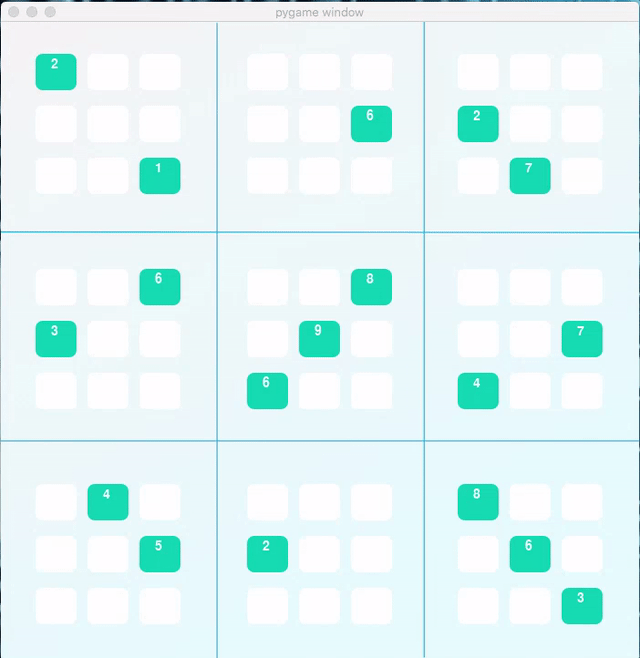

# Artificial Intelligence Nanodegree

This project aims to create an AI agent capable of solving any Sudoku puzzle as part of Udacity's Artificial Intelligence Nanodegree program.

## Introductory Project: Diagonal Sudoku Solver

To solve the Diagonal Sudoku I've used two different techniques: Constraint propagation and Search.

### Constraint propagation

Constraints are used to dramatically reduce the search space before applying search algorithms to AI problems. For the Sudoku puzzle, when we enforce a constraint to a given box, this introduces new constraints for its peers that help us reduce the number of possibilities, i. e., the search space.

### Search

Search is the process of traversing a tree of possibilities to find the possible solutions for a given problem. Some Sudoku puzzles cannot be solved by only using the Constraint propagation approach and a Search strategy come in handy in such a case.

There are different Search algorithms, and each one has its pros and cons. For this project, we're going to use the **Depth-first search** algorithm, which is a greedy search algorithm, that traverses the search tree to the deepest node.

## Question 1 (Naked Twins)
***Q: How do we use constraint propagation to solve the naked twins problem?***  

To solve the naked twins problem we use three different constraints that are applied repeatedly until it is not possible to reduce the puzzle anymore:

1. **Elimination** - Iterate over all the boxes in the puzzle that only have one value assigned to them and remove this value from every one of its peers;
2. **Only choice** - Assign a digit to a given box if this box is the only one in a unit which would allow that digit;
3. **Naked twins** - If there are two boxes in a given unit that have the same pair of values, remove these values from its peers.

## Question 2 (Diagonal Sudoku)
***Q: How do we use constraint propagation to solve the diagonal sudoku problem?***
  
The only change that has to be made to solve the diagonal Sudoku problem is to take into account the two additional diagonal units -- ['A1', 'B2', 'C3', 'D4', 'E5', 'F6', 'G7', 'H8', 'I9'] and ['I1', 'H2', 'G3', 'F4', 'E5', 'D6', 'C7', 'B8', 'A9'] -- when performing the constraint propagation steps mentioned earlier.

## Animated solution

This section presents the solution by means of an animation.



## Instructions

This section provides instructions to get your environment ready to deploy the code.

### Install

This project requires **Python 3**.

We recommend students install [Anaconda](https://www.continuum.io/downloads), a pre-packaged Python distribution that contains all of the necessary libraries and software for this project. 
Please try using the environment we provided in the Anaconda lesson of the Nanodegree.

##### Optional: Pygame

Optionally, you can also install pygame if you want to see your visualization. If you've followed our instructions for setting up our conda environment, you should be all set.

If not, please see how to download pygame [here](http://www.pygame.org/download.shtml).

### Code

* `solutions.py` - You'll fill this in as part of your solution.
* `solution_test.py` - Do not modify this. You can test your solution by running `python solution_test.py`.
* `PySudoku.py` - Do not modify this. This is code for visualizing your solution.
* `visualize.py` - Do not modify this. This is code for visualizing your solution.

### Visualizing

To visualize your solution, please only assign values to the values_dict using the ```assign_values``` function provided in solution.py

### Data

The data consists of a text file of diagonal sudokus for you to solve.

### Python environment

Please refer to [aind-environment.yalm](aind-environment.yalm) to reproduce the environment I've used to work on this project. If you are using pip, please refer to [aind-requirements.txt](aind-requirements.txt).